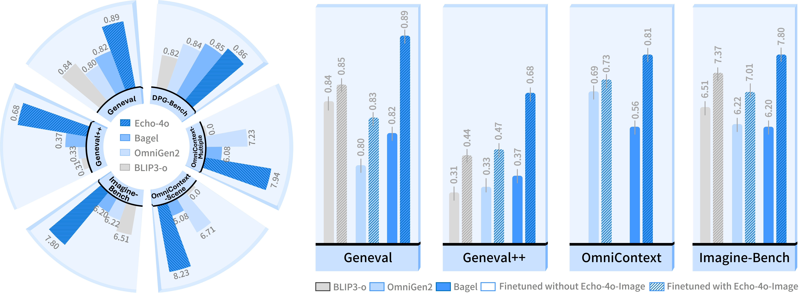
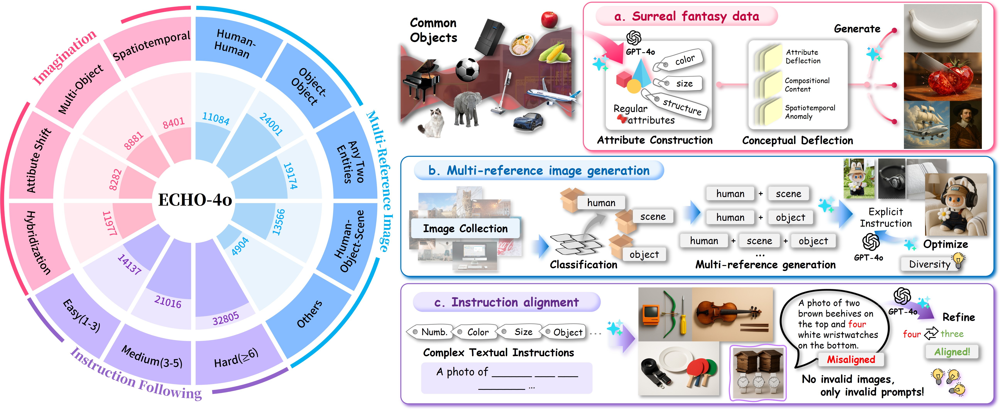
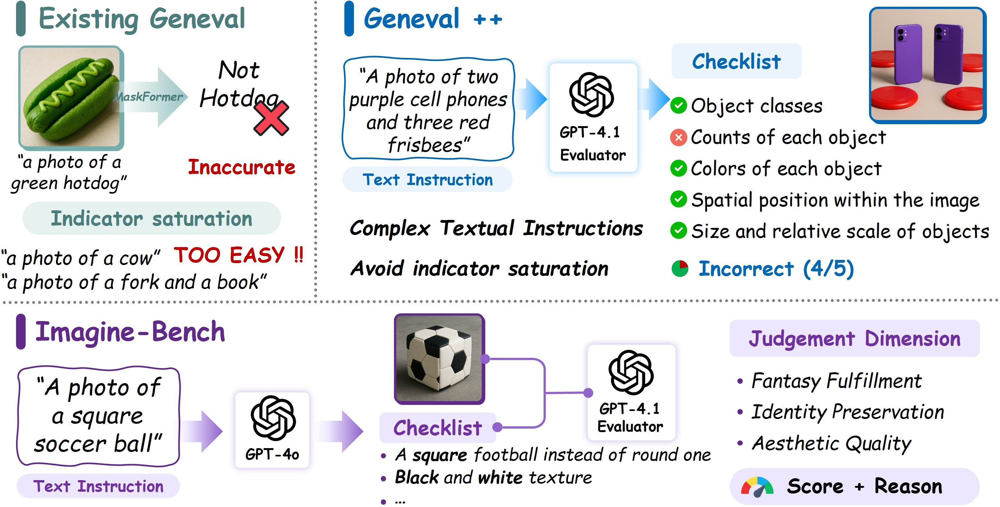

# Echo-4o: Harnessing the Power of GPT-4o Synthetic Images for Improved Image Generation
<a href="https://arxiv.org/abs/2508.09987" target="_blank"></a>
<a href='https://huggingface.co/datasets/Yejy53/Echo-4o-Image'></a>


## 📰 News

* **[2025.8.13]**  🔥 We have released **Echo-4o: Harnessing the Power of GPT-4o Synthetic Images for Improved Image Generation**. Check out the **[** [Paper](https://arxiv.org/pdf/2504.02782); [Dataset](https://huggingface.co/datasets/Yejy53/Echo-4o-Image); [Code](https://github.com/yejy53/Echo-4o/edit/main/README.md) **]**. 


## 🏆 Contributions

* ⁉️ **Why use synthetic data instead of real-world data?:** We analyze and summarize the advantages of synthetic data over real-world images, highlighting its ability to generate rare scenarios and to provide pure, long-tailed supervision for instruction-following tasks.
* 🔧 **How to generate synthetic data?**  We curate **Echo-4o-Image**, a synthetic dataset of ~180K samples generated using GPT-4o. Echo-4o-Image includes 38K surreal fantasy samples, 73K multi-reference image generation samples, and 68K complex instruction-following samples.
* ✨ **Does synthetic data work?** We fine-tune the Bagel model on Echo-4o-Image, yielding model **Echo-4o**, which achieves state-of-the-art performance across multiple benchmarks. Furthermore, Echo-4o-Image consistently enhances other backbone models such as OmniGen2 and BLIP3-o, demonstrating strong transferability.
* 📐 **How to evaluate performance?** We propose two new evaluation benchmarks: **Geneval++** increases instruction complexity to alleviate score saturation in text-to-image evaluation. **Imagine-Bench** targets fantasy tasks and is designed to assess both understanding and generation of imaginative content.



## 🎨Echo-4o-Image

🔗 Dataset on Hugging Face: [Echo-4o-Image](https://huggingface.co/datasets/Yejy53/Echo-4o-Image)

We introduce Echo-4o-Image, a large-scale synthetic dataset distilled from GPT-4o.It contains approximately 179,000 samples spanning three distinct task types: 38K surreal fantasy generation tasks, 73K multi-reference image generation tasks, and 68K complex instruction execution tasks. 

For better visualization, we provide an online gallery showcasing representative samples from our dataset: [Online Gallery](https://yejy53.github.io/Echo-4o/)




## 🤖 Echo-4o
First, prepare your environment by following the setup instructions in the [Bagel environments](https://github.com/bytedance-seed/BAGEL?tab=readme-ov-file#:~:text=1%EF%B8%8F%E2%83%A3-,Set%20up%20environment,-git%20clone%20https).

#### Training

Our training code extends Bagel's capabilities to support multi-reference datasets for training.

Data Preparation:

- Follow the same [data preparation process](https://github.com/ByteDance-Seed/Bagel/blob/main/TRAIN.md#data-prepration) as outlined in Bagel's documentation 
- Ensure your multi-reference data follows the expected format in our data example [here]()

Training Process: 

Our training scripts use the same interface and parameters as Bagel, so you can use the [existing training commands and configurations of Bagel](https://github.com/ByteDance-Seed/Bagel/blob/main/TRAIN.md#training) without modification.

#### Inference

+ Text-to-Image Tasks

  For standard text-to-image generation, use the same inference process as Bagel:

  Refer to the [text-to-image generation example](inference.ipynb) here

+ Multi-Reference Tasks

  For tasks involving multiple references, refer to the [multi-reference example](inference_multiref.ipynb) here


## 📏 GenEval++ & Imagine-Bench

To rigorously evaluate the model’s instruction-following and imaginative generation, we further introduce two novel benchmarks: **Geneval++** and **Imagine-Bench**. Geneval++ incorporates an automated evaluator powered by GPT-4.1 and significantly increases the difficulty and compositional complexity of test instructions, addressing the limitations of scoring saturation and insufficient accuracy found in existing text-to-image evaluations. Imagine-Bench focuses on imaginative generation, offering a comprehensive evaluation of conceptual creativity and visual consistency across three dimensions: fantasy fulfillment, identity preservation, and aesthetic quality.

We provide benchmark guides for GenEval++ and Imagine-Bench. For more details, see [EVAL](EVAL.md).




## ❤️ Acknowledgements

We would like to thank the following open-source projects and research works:

* [Bagel](https://github.com/ByteDance-Seed/Bagel)
* [BLIP3o](https://github.com/JiuhaiChen/BLIP3o)
* [OmniGen2](https://github.com/VectorSpaceLab/OmniGen2?tab=readme-ov-file)


## 📕 BibTeX 

```bib
@article{ye2025echo4o,
      title={Echo-4o: Harnessing the Power of GPT-4o Synthetic Images for Improved Image Generation}, 
      author={Junyan Ye, Dongzhi Jiang, Zihao Wang, Leqi Zhu, Zhenghao Hu, Zilong Huang, Jun He, Zhiyuan Yan, Jinghua Yu, Hongsheng Li, Conghui He, Weijia Li},
      journal={https://arxiv.org/abs/2508.09987},
      year={2025},
}
```